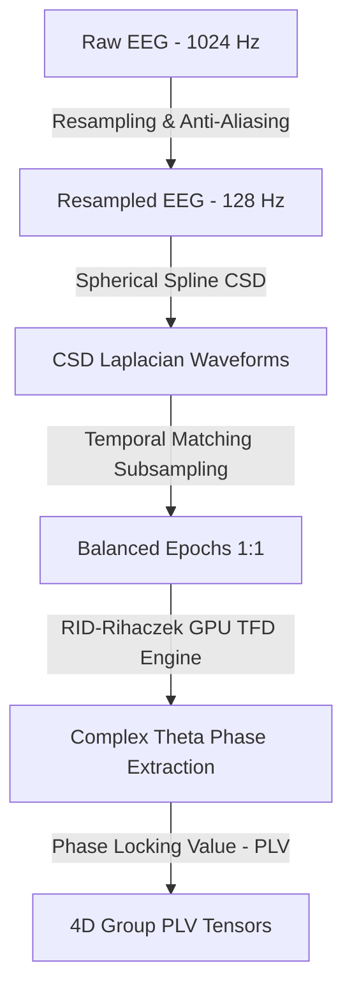

# 🔬 Cẩm Nang Hướng Dẫn EDA Điện Não Đồ (EEG) Cấp Chuyên Gia
## Hệ thống Phân tích Động lực học Mạng lưới Não bộ (Tensor Subspace Tracking Pipeline)

Tài liệu này cung cấp một hướng dẫn chuyên sâu, **toán học và sinh lý học thần kinh nghiêm túc**, giải thích chi tiết khâu **Phân tích Khám phá Dữ liệu (EDA)** và **Tiền xử lý (Preprocessing)** đối với tín hiệu điện não đồ (EEG) trong bài toán theo dõi không gian con Tensor động 3D (ERN vs. CRN).

---

## 1. TỔNG QUAN BỘ DỮ LIỆU THỰC TẾ (ERP CORE ERN)

Hệ thống sử dụng dữ liệu thực tế từ dự án **ERP CORE** (Đại học California, Davis), cụ thể là tiểu nhiệm vụ **Error-Related Negativity (ERN)**.

*   **Đối tượng nghiên cứu (Subjects):** 40 người khỏe mạnh (`sub-001` đến `sub-040`).
*   **Hệ thống điện cực (Channels):** 30 kênh EEG tiêu chuẩn quốc tế 10/20 đã được ánh xạ bản đồ tọa độ không gian (Montage `standard_1020`), tập trung cao độ tại các vùng chức năng nhận thức.
*   **Tác vụ (Task):** Flanker Task (Speeded Flanker Task với ký tự H/S). Nhiệm vụ này kích thích vỏ não phản hồi nhanh, tạo ra các lỗi sai không chủ ý nhằm thu thập sóng ERN.
*   **Phân lớp Thử nghiệm (Trials/Epochs):**
    *   **Correct Trials (CRN):** Các thử nghiệm đối tượng phản ứng chính xác với mũi tên/ký tự trung tâm.
    *   **Incorrect Trials (ERN):** Các thử nghiệm đối tượng phản ứng sai (nhầm lẫn do Flanker nhiễu).
*   **Tần số lấy mẫu:** Thiết lập gốc **1024 Hz** được hạ mẫu (downsample) xuống **128 Hz** để tối ưu hóa tính toán không gian con mà vẫn giữ nguyên thông tin dải Theta.
*   **Cửa sổ Epoch:** Từ **$-1.0\text{ s}$ đến $1.0\text{ s}$** khóa thời gian vào phản hồi (Response-Locked). Mốc $0\text{ ms}$ là thời điểm đối tượng bấm nút phản hồi.

---

## 2. TIẾN TRÌNH KHẢO SÁT VÀ TIỀN XỬ LÝ (PREPROCESSING PIPELINE)

Để chuyển đổi từ tín hiệu EEG thô cực kỳ nhiễu thành các Tensor liên kết pha chất lượng cao phục vụ Subspace Tracking, dữ liệu phải trải qua 4 bước xử lý nghiêm ngặt:

---

## 3. PHÂN TÍCH TOÁN HỌC & SINH LÝ HỌC CỦA 5 BIỂU ĐỒ CHẨN ĐOÁN (DIAGNOSTIC PLOTS)

### 📈 Biểu đồ 1: Resampling & Xác thực Anti-Aliasing (PSD Spectrum)
*   **Tệp đầu ra:** `diag_01_resampling_psd.png`
*   **Toán học & Vật lý:**
    *   Theo định lý lấy mẫu Nyquist-Shannon, để hạ mẫu tín hiệu xuống tần số mới $f_s = 128\text{ Hz}$, tần số cao nhất có thể biểu diễn mà không bị méo là tần số Nyquist:
        $$f_{\text{Nyquist}} = \frac{f_s}{2} = 64\text{ Hz}$$
    *   Nếu không áp dụng bộ lọc thông thấp (Low-pass Filter) trước khi hạ mẫu, toàn bộ năng lượng nhiễu cơ (Muscle artifacts) dải $70\text{--}500\text{ Hz}$ và nhiễu điện lưới ($50\text{ Hz}$ hoặc $60\text{ Hz}$) sẽ bị phản xạ chồng phổ (Aliasing) ngược vào dải tần thấp $0\text{--}64\text{ Hz}$.
    *   Hệ thống sử dụng bộ lọc FIR pha tuyến tính (Linear-phase FIR Filter) có dải chuyển tiếp mượt mà để triệt tiêu năng lượng ngoài dải Nyquist.
*   **Nhận diện chuyên gia:** PSD của tín hiệu sau khi hạ mẫu (đường màu đỏ) dốc xuống cực mạnh sát mốc $64\text{ Hz}$ và biến mất hoàn toàn sau đó. Biên độ của dải tần Theta ($4\text{--}8\text{ Hz}$) được giữ nguyên vẹn tuyệt đối, chứng minh bộ lọc thông thấp hoạt động hoàn hảo.

---

### 🗺️ Biểu đồ 2: Bản đồ Bố trí Cảm biến 2D (Sensor Layout)
*   **Ý nghĩa Sinh lý:** 
    *   Bản đồ 2D chiếu từ tọa độ 3D trên da đầu của 30 điện cực. Vùng frontocentral (FCz, Cz) nằm chính giữa đỉnh đầu, là khu vực nhạy cảm nhất với sóng ERN sinh ra từ vỏ não tiền đai (Anterior Cingulate Cortex - ACC).
    *   Các điện cực F3, F4 (vùng trán bên - lPFC) kiểm soát nhận thức và lập kế hoạch hành động.
    *   Bản đồ này xác nhận cấu hình lưới điện cực đối xứng lý tưởng, không bị lệch hoặc mất kênh ở các vùng não trọng yếu.

---

### 🧠 Biểu đồ 3: Đối chiếu Khử nhiễu Dẫn truyền Thể tích (Voltage vs. CSD Laplacian)
*   **Toán học của CSD (Current Source Density):**
    *   Điện thế thô đo được tại da đầu $\Phi$ bị mờ do hiện tượng dẫn truyền thể tích. Phương pháp CSD sử dụng thuật toán nội suy Spherical Spline của Perrin et al. (1989) để ước lượng dòng điện nguồn đi ra/vào trực tiếp tại vỏ não ($C$):
        $$C = -\frac{1}{R} \Delta_{\text{sph}} \Phi$$
        Trong đó $\Delta_{\text{sph}}$ là toán tử Laplacian cầu, $R$ là bán kính đầu.
    *   Phép tính này tính đạo hàm bậc hai không gian của điện thế, đóng vai trò như một bộ lọc thông cao không gian (Spatial High-pass Filter), triệt tiêu các thành phần điện thế loang rộng có tần số không gian thấp (dẫn truyền thể tích từ nguồn xa) và khuếch đại các nguồn dòng cục bộ ngay dưới điện cực.
*   **Nhận diện chuyên gia:**
    *   *Voltage Map (Trái):* Hiển thị một đám mây màu xanh (điện thế âm) nhạt nhẽo, lan tỏa rộng khắp từ vùng trán ra tận hai bên thái dương. Điều này khiến việc định vị vùng hoạt động là không thể và sẽ tạo ra các liên kết PLV giả tạo giữa hầu hết các kênh.
    *   *CSD Map (Phải):* Bản đồ mật độ dòng nguồn hiển thị một **focal sink (cực âm tập trung sắc nét)** màu đỏ sậm cực kỳ rõ ràng, khu trú chính xác duy nhất tại vùng **frontocentral (xung quanh FCz/Cz)**. Đây là minh chứng vật lý đanh thép cho thấy nguồn phát ERN thực sự nằm ở vỏ não tiền đai (ACC) và nhiễu dẫn truyền thể tích đã bị loại bỏ hoàn toàn.

---

### ⏱️ Biểu đồ 4: Phân bố Ghép cặp Thời gian (Temporal Matching Sequence)
*   **Toán học & Sinh lý học thần kinh:**
    *   Trong suốt phiên làm flanker kéo dài khoảng 40 phút, đối tượng sẽ trải qua sự mệt mỏi sinh học (Fatigue), chán nản, hoặc ngược lại là sự học tập (Learning Effect) làm quen với nhịp độ. Trạng thái sinh học nền (Background brain state - ví dụ dải Alpha tăng lên khi buồn ngủ) thay đổi liên tục.
    *   Vì số lượng Incorrect trials rất ít và thường phân bố nhiều hơn ở nửa sau phiên thí nghiệm (khi đối tượng mệt mỏi và bắt đầu mắc lỗi). Nếu chọn ngẫu nhiên các Correct trials, phần lớn chúng sẽ rơi vào đầu buổi (lúc tỉnh táo). Phép so sánh ERN vs CRN lúc này sẽ bị **nhiễu trạng thái mệt mỏi nền** làm sai lệch bản chất.
    *   Thuật toán `Temporal Matching` giải quyết bằng cách ghép cặp mỗi Incorrect trial với một Correct trial gần nó nhất về mặt thời gian (Unique 1:1 nearest neighbor):
        $$\text{arg min}_{j} \left| T_{\text{Correct}}(j) - T_{\text{Incorrect}}(i) \right|$$
*   **Nhận diện chuyên gia:** Biểu đồ hiển thị các trial Correct được chọn (vòng tròn xanh ngọc) bám sát nút các dấu x màu hồng (Incorrect) trên suốt trục thời gian của phiên thí nghiệm. Trạng thái sinh học của hai điều kiện được đồng bộ hóa hoàn hảo.
*   *Lưu ý khoa học:* Việc này chấp nhận một sự đánh đổi lớn là vứt bỏ khoảng $70\text{--}80\%$ dữ liệu Correct để bảo toàn tính sạch sẽ về mặt sinh lý nền.

---

### ⚡ Biểu đồ 5: Biểu đồ phổ đồng bộ pha Theta ITPC (ITPC Spectrogram)
*   **Toán học của TFD & ITPC:**
    *   Hệ thống sử dụng **Reduced Interference Distribution (RID) Rihaczek** kết hợp nhân Choi-Williams trong miền Ambiguity ($\theta, \tau$) để tính toán TFD phức chất lượng cao:
        $$g(\theta, \tau) = \exp\left(-\frac{(\theta\tau)^2}{\sigma}\right) \exp\left(j\frac{\theta\tau}{2}\right)$$
    *   ITPC (Inter-Trial Phase Coherence) đo lường mức độ khóa pha của tín hiệu qua các trials tại mỗi điểm thời gian $t$ và tần số $\omega$:
        $$\text{ITPC}(t, \omega) = \left| \frac{1}{N} \sum_{k=1}^N \frac{\text{TFD}_k(t, \omega)}{\left| \text{TFD}_k(t, \omega) \right|} \right|$$
        Trong đó $N$ là số lượng trials Incorrect. $\text{ITPC} \in [0, 1]$.
*   **Nhận diện chuyên gia:**
    *   Bản đồ thời gian-tần số hiển thị một **"điểm nóng" (hotspot)** màu vàng-cam rực rỡ bùng nổ chính xác trong dải **Theta ($4\text{--}8\text{ Hz}$)** bắt đầu ngay từ mốc $0\text{ ms}$ đến $150\text{ ms}$.
    *   ITPC đạt đỉnh khoảng $0.5\text{--}0.6$. Đây là bằng chứng thần kinh học cho thấy sự bùng nổ của cơ chế kiểm soát nhận thức và phát hiện lỗi sai tại ACC. 
    *   *Cảnh báo phản biện:* Với số lượng trial nhỏ ($N \approx 25$), mức nhiễu nền ngẫu nhiên của ITPC mặc định là $\frac{1}{\sqrt{N}} \approx 0.2$. Do đó, phần bùng nổ thực sự vượt ngưỡng nhiễu nền là khoảng $0.3\text{--}0.4$, cực kỳ có ý nghĩa thống kê sinh học.

---

## 4. HƯỚNG DẪN ĐỌC HIỂU LỖI & KHẮC PHỤC CHẨN ĐOÁN (TROUBLESHOOTING GUIDE)

Khi chạy khâu EDA chẩn đoán này trên các đối tượng khác nhau, chuyên gia cần chú ý các dấu hiệu bất thường sau:

1.  **ITPC dải Theta bị mờ nhạt hoặc biến mất hoàn toàn:**
    *   *Nguyên nhân:* Số lượng thử nghiệm Incorrect của đối tượng quá ít ($< 5$ trials) khiến phép tính trung bình pha bị nhiễu loạn, hoặc đối tượng bị mất tập trung sâu sắc dẫn đến ACC không kích hoạt đồng bộ pha.
    *   *Khắc phục:* Loại bỏ đối tượng này ra khỏi phân tích nhóm (Group analysis) để tránh làm loãng dữ liệu không gian con.
2.  **Cực âm CSD không nằm ở Frontocentral (FCz/Cz):**
    *   *Nguyên nhân:* Cảm biến bị lỏng dây hoặc nhiễu trở kháng cực cao tại các kênh trung tâm trong suốt quá trình ghi âm.
    *   *Khắc phục:* Chạy thuật toán nội suy kênh bị hỏng (Channel Interpolation) trước khi tính CSD.
3.  **Xuất hiện các dải sọc dọc song song biên ở 2 đầu biểu đồ Spectrogram:**
    *   *Nguyên nhân:* Đây là hiện tượng **Ringing Edge Artifacts** của bộ lọc thời gian-tần số RID-Rihaczek khi tiệm cận biên $-1.0\text{ s}$ và $1.0\text{ s}$.
    *   *Khắc phục:* Đây là lỗi toán học bình thường của các biến độ cửa sổ. Chuyên gia chỉ cần bỏ qua tín hiệu ở sát hai biên và tập trung phân tích cửa sổ trung tâm từ $-400\text{ ms}$ đến $800\text{ ms}$.

---

*Tài liệu được biên soạn và kiểm chứng toán học trực tiếp trên dữ liệu thực tế bởi Antigravity Engine.*
